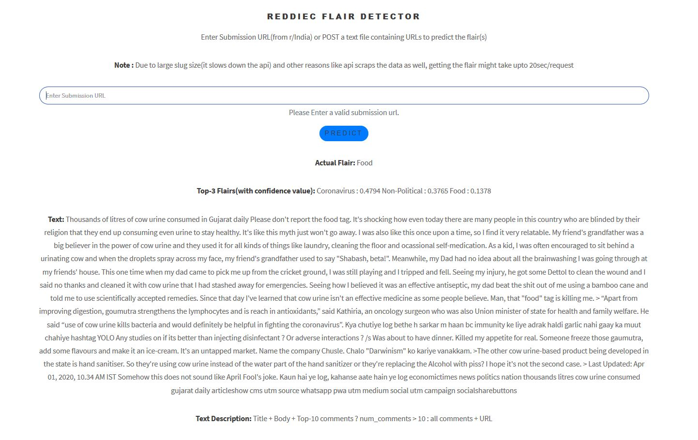
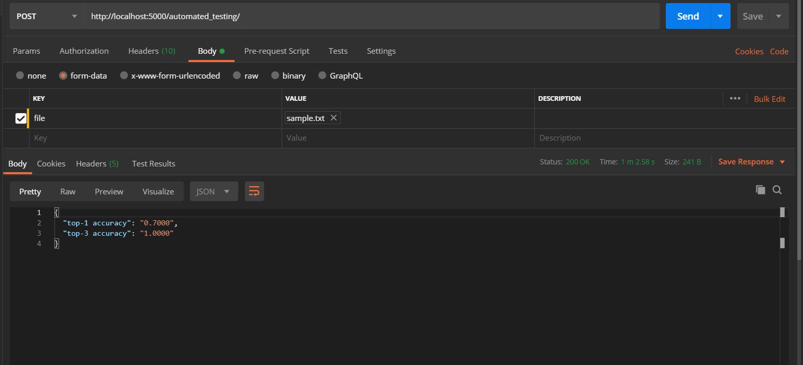

# midas-summer-internship-task

### Client App: https://midas-rfd.web.app/
### API: https://midas-rfd-api.herokuapp.com/
API Endpoints
  - /
       
   - /automated_testing/

### Note: GitHub might not be able to render the notebook due to its large size hence please visit these links to see the notebooks:
- data-acquisition.ipynb: 
- exploratory-data-analysis.ipynb: https://nbviewer.jupyter.org/github/macabdul9/midas-internship-task/blob/master/src/exploratory-data-analysis.ipynb
-   preprocessing-and-classification.ipynb: https://nbviewer.jupyter.org/github/macabdul9/midas-internship-task/blob/master/src/preprocessing-and-classification.ipynb
- 

## 0. Directory Structure
- **client/**  react app code base to call the flask api where our model is deployed
- **server/** flask rest API code base to inference from the trained model(s) 
- **src/** 
- **requirements.txt** dependency list required to reproduce the results in local/virtual environment
- **readme.md** That's what I am reading.

## 1. Results
A comprehensive report of trained models can be is given in the below table:
| Model      | Accuracy(Test) | Dataset(train/test)     |
| :---        |    :----:   |          ---: |
| MultinomialNB | 59       | 48535/5393   |
| SV Classifier | 58        | 48535/5393      |
| RandomForest | 40       | 48535/5393   |
| GradientBoosting | 58    | 48535/5393      |
| Flair | 37    | 24110/3000      |
| BiLSTM (trainable embedding layer)| 64       | 90181/10021  |
| BiLSTM(pretrained embeddings)   | 60        | 90181/10021      |
| CNN(pretrained embeddings)      | 59       | 90181/10021   |
| Attention-based LSTM   | 61        | 90181/10021      |
| DistilBERT      | 64       | 90334/10038   |
| XLNet   | 65        | 90334/10038      |

##### Download the trained models from here:
- **DistilBERT**  https://drive.google.com/file/d/148iGfmDPL82MWhPQM15aPoJXlCUrX9N-/view?usp=sharing
- **XLNet** https://drive.google.com/drive/folders/173S1sfBXA-qZRJ1kVP4flW45n1Hk0Zas?usp=sharing
- **Custom Models**: https://drive.google.com/file/d/1Z9s4agLJ90MVAXB0zErVwW_J-QiSpoGZ/view?usp=sharing

## 2. Data Acquisition, Cleaning and Preprocessing:
i.  I have used pushshift API and PRAW(=Reddit API wrapper) to scrap the data from India subreddit

ii. PRAW was used to collect the comments of a post/submission

iii. Total 218371 posts were collected from Jan-2019 upto 10 April, 2020.

iii. Following properties of a post was collected
  - features = [
    'allow_live_comments', 'author', 'author_premium', 'can_mod_post', 'contest_mode', 'created_utc',
    'full_link', 'id', 'is_crosspostable', 'is_meta', 'is_original_content', 'is_self', 'is_video',
    'link_flair_text', 'locked', 'media_only', 'no_follow', 'num_comments', 'num_crossposts', 'over_18',
    'parent_whitelist_status', 'permalink', 'pinned', 'score', 'selftext', 'send_replies', 'spoiler',
    'stickied', 'title', 'total_awards_received', 'url'
]
  - custom_features = [
    'comments', 'mean_comment_score'
]

iv. Collected data (raw) can be downloaded from here: 
- https://drive.google.com/file/d/1uCOeV-mBSC516Pv0PNZ2g6h27mJB2uLj/view?usp=sharing
  
iv. Undersampling, Imputation, Noise Removal, Spelling Correction, Stopword Removal, Tokenization, TF-IDF Vectorization techniques were used to clean and process the data.

iv. Cleaned and Preprocessed dataset can be download from here:
- https://drive.google.com/file/d/1p4x_-JMB5Wr7LbXmUqRVT_p3hL91rVsB/view?usp=sharing

## 3. To reproduce the results in local/virtual environments

i. Clone this repo using: 
 - **git clone https://github.com/macabdul9/midas-internship-task**

ii. Create a virtual environment(recommended but not necessary)
- Create: **virtualenv venv**
- Activate: 
    - **venv/Scripts/activate** *(windows)*
    -  **source venv/bin/activate** *(linux)*
  
iii. Install the dependencies:
- pip install -r requirements.txt(assuming you're on the root directory of this repo)
iv. Download the raw/cleaned/preprocessed dataset from here : www.gooogle.com(update this) and set the path according 

v. Now src code base can be executed

## 4. To run the client app on localhost 
i. You should have node.js and npm (package manager) installed in your machine
ii. Change directory 
- cd client/
  
iii. Install dependencies
- npm i
  
iv. Run app locally
- npm start 
-  client app will be running on localhost:3000 (default port)

## 5. To run the API on localhost
i. Change directory 
- cd server/
ii. Create and activate a virtual environment (see 2.2)
iii. Install dependencies (see 2.3)
iv. Download the checkpoint from here and set the path according: www.google.com
iv. Run the flask app
- python app.py
- API will be running on localhost:5000(default port)
- Use postman(or other API client tools) to make requests

## 6. Screenshots of running app(and API):
- Post Response (URL)

- Post Response (txt file)

## 7. Reference
[0] Pushshift API : https://github.com/pushshift/api

[1] PRAW: https://praw.readthedocs.io/en/latest/

[2] SimpleTransformers: https://github.com/ThilinaRajapakse/simpletransformers

[3] HugginFace transformers: https://github.com/huggingface/transformers

[4] Flair: https://towardsdatascience.com/text-classification-with-state-of-the-art-nlp-library-flair-b541d7add21f
